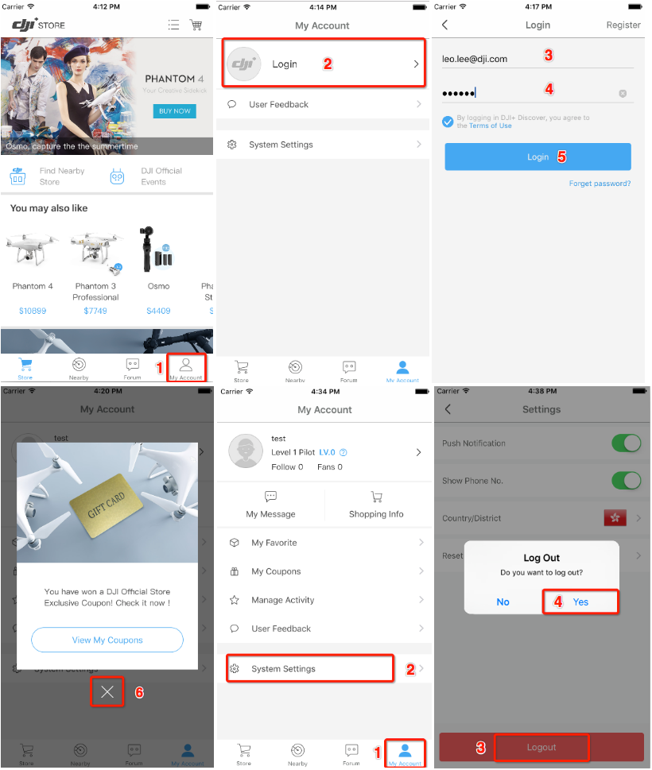
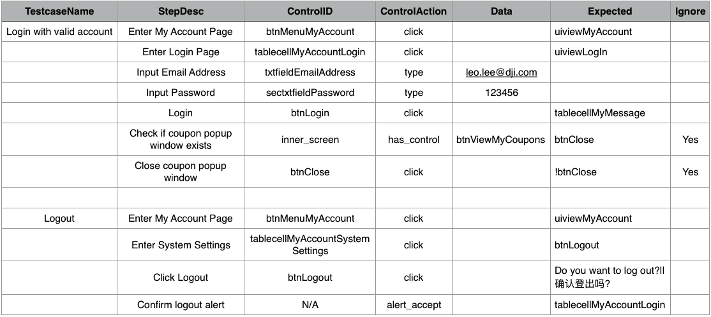

## AppiumBooster

AppiumBooster helps you to write automation testcases in tables, without writing a snippet of code.

## write testcases

You can write testcases in any table tools, including MS Excel and iWork Numbers, and even in plain CSV format.

Take DJI+ Discover's login and logout function as an example.



In order to test these functions above, you can write testcases in tables like this.



After the testcases are finished, export to CSV format, and put the csv files under `ios/testcases/` directory.

That's all you need to do, and now you are ready to run automation test on your app.

## run

Run the automation testcases is very easy. Just execute `ruby run.rb` in the project root directory.

```bash
➜  AppiumBooster git:(master) ✗ ruby run.rb
```

AppiumBooster will load all the csv test suites and then excute each suite sequentially.

```
➜  AppiumBooster git:(master) ✗ ruby run.rb
initialize appium driver ...
start appium driver ...
alert accepted!
======= start to run testcase suite: ./ios/testcases/Account-Login and Logout.csv =======
load csv testcase file: ./ios/testcases/Account-Login and Logout.csv ...
B------ Start to run testcase: Login with valid account
step_1: Enter My Account Page
control_element.click    ...    ✓
uiviewMyAccount exsits?    ...    ✓
step_2: Enter Login Page
control_element.click    ...    ✓
uiviewLogIn exsits?    ...    ✓
step_3: Input Email Address
control_element.type 'leo.lee@debugtalk.com'    ...    ✓
step_4: Input Password
control_element.type '123456'    ...    ✓
step_5: Login
control_element.click    ...    ✓
tablecellMyMessage exsits?    ...    ✓
step_6: Check if coupon popup window exists
inner_screen.has_control 'btnViewMyCoupons'    ...    ✓
btnClose exsits?    ...    ✓
step_7: Close coupon popup window
control_element.click    ...    ✓
!btnClose no longer exsits?    ...    ✓
E------ Login with valid account

B------ Start to run testcase: Logout
step_1: Enter My Account Page
control_element.click    ...    ✓
uiviewMyAccount exsits?    ...    ✓
step_2: Enter System Settings
control_element.click    ...    ✓
btnLogout exsits?    ...    ✓
step_3: Click Logout
control_element.click    ...    ✓
Do you want to log out? exsits?    ...    ✓
step_4: Confirm logout alert
alert accepted!
alert_accept    ...    ✓
tablecellMyAccountLogin exsits?    ...    ✓
E------ Logout

============ all testcases have been executed. ============
quit appium driver.
```
